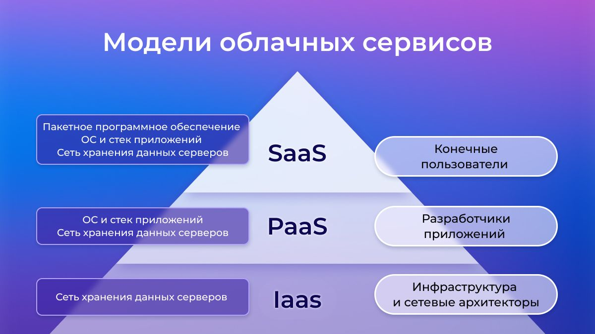
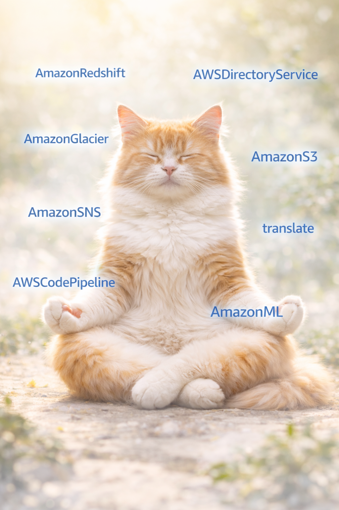

## Рассмотрим классификацию облачных сервисов 

Мы выбрали 1 вариант облачной лабораторной


Если рассматривать конкретно AWS (Amazon Web Services) распределение будет следующим:  

**IaaS (Infrastructure as a Service)**
- Amazon S3 - Объектное хранилище — основа AWS
- Amazon Glacier - Архивное хранилище с очень низкой стоимостью  

**PaaS (Platform as a Service)**
- Amazon Redshift - Облачное хранилище данных
- AWS Directory Service- Сервис для управления каталогами (директориями)
- Amazon SNS  - Рассылка уведомлений
- AWS CodePipeline - Автоматизация сборки, тестирования и развёртывания приложения при каждом коммите в Git

**SaaS (Software as a Service)** 
- Amazon Translate  - API для машинного перевода текста
- Amazon ML - Устаревший сервис прогнозной аналитики



---

#### Usage Type - эта колонка показывает что означает каждый шаблон и действие он отражает
Node - вычисления  
RMS - хранилище  
DataScanned - обработка данных   

Все что с абривиатурой AD - дирректории

ProvisionedCapacityUnit - выделенная ёмкость для быстрого извлечения
TimedStorage / TagStorage - хранение различных метрик  
Requests-Tier - запросы разной стоимости
EarlyDelete - штраф за раннее удаление данных 

DeliveryAttempts - доставка уведомлений с разными типами данных
SMS-Sent/Price - метрики SMS (количество и стоимость в данном случае)

 ---

### Теперь переходим непосредственно к заполнению пустых столбцов, будем двигаться по следующей схеме: 
```IT Tower → Service Family → Service Type → Service Sub Type → Service Usage Type```

### IT Tower
Для выбора катекогрии в этой колонке, нужно обратить внимание на данные из Product Code

| IT Tower     | Количество строк | Доля (%) |
|--------------|------------------|----------|
| **Storage**  | 16               | 43.24%   |
| **Application** | 8             | 21.62%   |
| **Platform** | 6                | 16.22%   |
| **Security** | 5                | 13.51%   |
| **Database** | 5                | 13.51%   |

### Service Family

| Service Family              | Количество | Доля (%) |
|-----------------------------|------------|----------|
| **Storage&Content Delivery** | 16         | 41.03%   |
| **Analytics**                | 5          | 12.82%   |
| **Security and Identity**    | 5          | 12.82%   |
| **Artificial Intelligence**  | 6          | 15.38%   |
| **Application Services**     | 5          | 12.82%   |
| **Developer Tools**          | 3          | 7.69%    |
