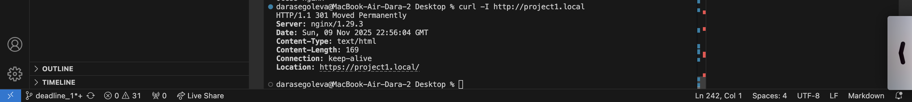
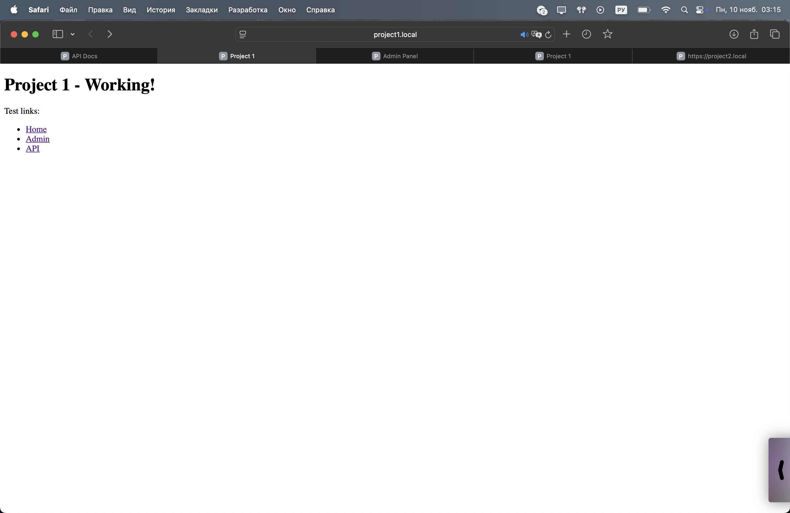
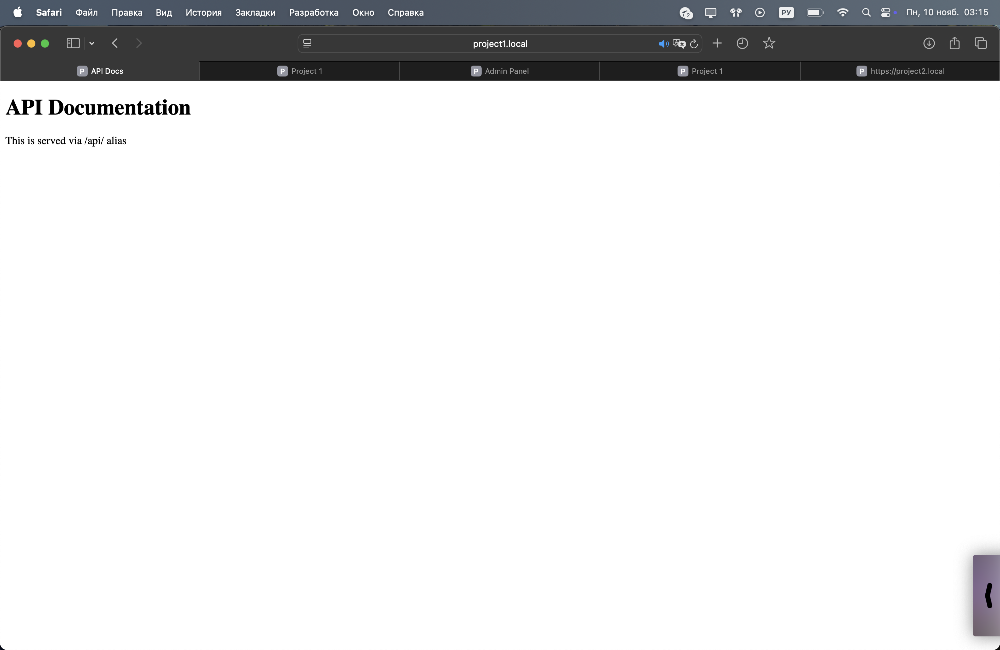
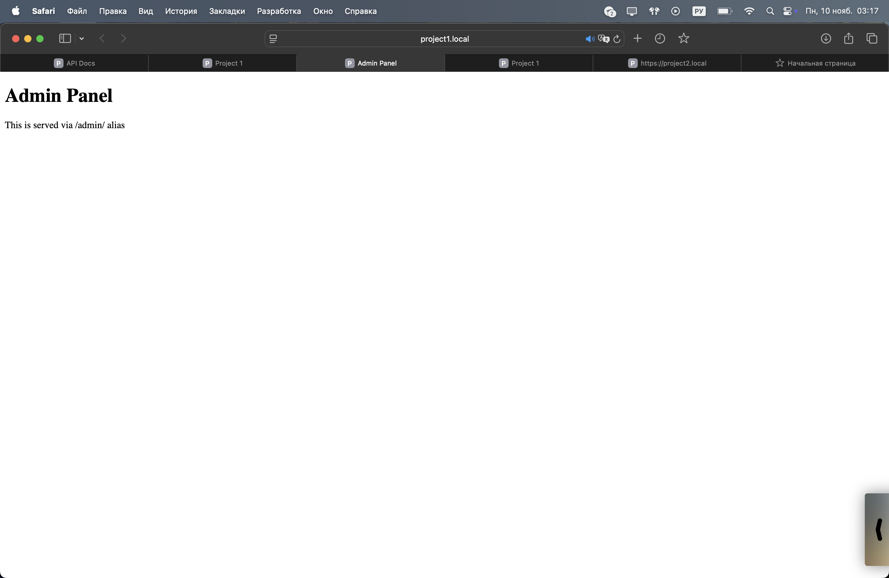
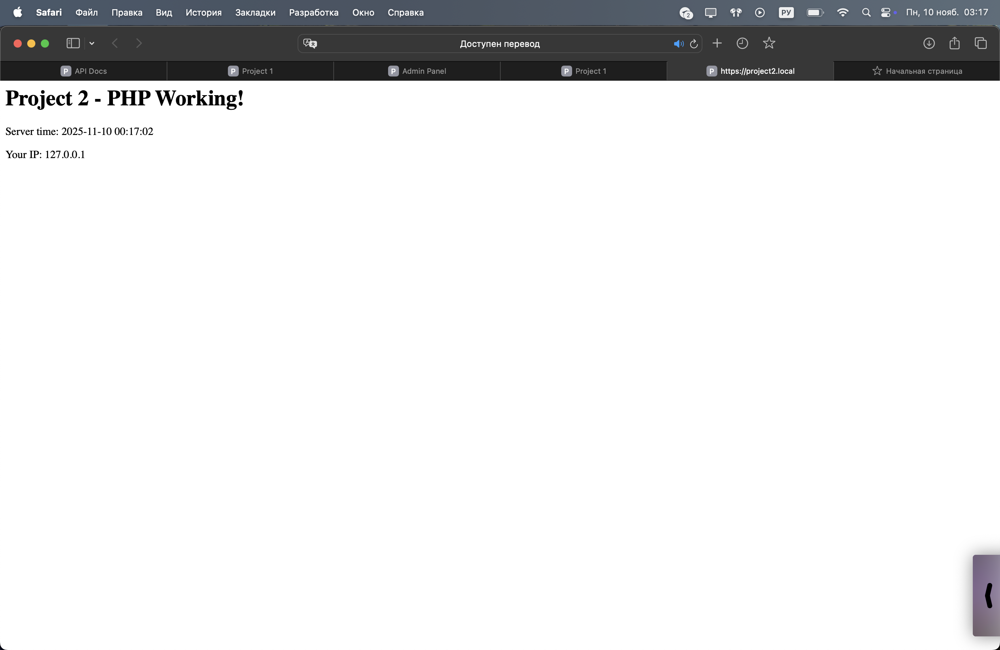

# Лабораторная 1 (настроить nginx)

## 0. Что происходило в начале? (Главные проблемсы)
С чего бы начать... Это был тяжелый путь, но у нас получилось, в целом, было очень много проблем с данной лабой. Возникали они в настройке конфига, alias и других штучках, так что можете подготовиться, взять чаек и наслаждаться моим прекрасным рассказом.

## 1. Настраиваем
Конечно, чтобы все работало, нам нужно установить nginx (интерестинг факт: у меня есть их мерч ) и php. Казалось бы, а зачем нам php, но это просто моя хотелка с динамическим содержимым сайта (спойлер: это будет просто время).
```
brew install nginx php

brew services start nginx // все запускаем
brew services start php
```

## 2. Создаем структуру проекта

Директории для проектов, тут есть разделение на логи и публичые файлы
```
mkdir -p /opt/homebrew/var/www/project1/{public,logs}
mkdir -p /opt/homebrew/var/www/project2/{public,logs}
```
Директории для конфигов nginx, в целом, я похожее наблюдала у знакомых с хакатонов, они говорили, что имеет смысл available для чистой редакции, то есть можно не трогать работающий сайт, а редактировать его без вреда таким образом, поэтому я решила с этим поиграться, но это совсем другая история
```
mkdir -p /opt/homebrew/etc/nginx/sites-{available,enabled}
mkdir -p /opt/homebrew/etc/nginx/ssl
```

## 3. Создадим файлы проектов

Тут у нас ```project1```, с его главной страницей. По сути как раз таки с нее должен быть редирект на две другие страницы - admin, api (так как они чисто для теста, то, конечно, никакой смысловой нагрузки не несут)
```
cat > /opt/homebrew/var/www/project1/public/index.html << 'EOF'
<!DOCTYPE html>
<html>
<head>
    <title>Project 1</title>
</head>
<body>
    <h1>Project 1 - Working!</h1>
    <p>Test links:</p>
    <ul>
        <li><a href="/">Home</a></li>
        <li><a href="/admin/">Admin</a></li>
        <li><a href="/api/">API</a></li>
    </ul>
</body>
</html>
```
Тут часть ```админки```
```
cat > /opt/homebrew/var/www/project1/public/admin.html << 'EOF'
<!DOCTYPE html>
<html>
<head>
    <title>Admin Panel</title>
</head>
<body>
    <h1>Admin Panel</h1>
    <p>This is served via /admin/ alias</p>
</body>
</html>
```
А тут, ```api```
```
cat > /opt/homebrew/var/www/project1/public/api.html << 'EOF'
<!DOCTYPE html>
<html>
<head>
    <title>API Docs</title>
</head>
<body>
    <h1>API Documentation</h1>
    <p>This is served via /api/ alias</p>
</body>
</html>
```

И вот здесь добавим легонькую динамику - ```project2```
```
cat > /opt/homebrew/var/www/project2/public/index.php << 'EOF'
<?php
echo "<h1>Project 2 - PHP Working!</h1>";
echo "<p>Server time: " . date('Y-m-d H:i:s') . "</p>";
echo "<p>Your IP: " . $_SERVER['REMOTE_ADDR'] . "</p>";
?>
```

Казалось бы, а что тут не так? Это я уже поняла после того, как увидела свой примитивный сайтик. Тут время по GMT, а в РФ оно +3, так что выходит, что оно показывает не наше время... Это грустно, но я думаю, что даже так, нам этого хватит для небольшой динамической импровизации

# 4. Делаем самоподписанный сертификат

Дла освежения своих знаний насчет SSL, очень помог Хабр, а именно <https://habr.com/ru/articles/884898/>

```-x509``` - самоподписанный сертификат

```-nodes``` - без пароля на ключ (это как раз нам и нужно)

```-days 365``` - срок действия 1 год

```-newkey rsa:2048``` - RSA ключ 2048 бит

```
sudo openssl req -x509 -nodes -days 365 -newkey rsa:2048 \ 
    -keyout /opt/homebrew/etc/nginx/ssl/project1.local.key \
    -out /opt/homebrew/etc/nginx/ssl/project1.local.crt \
    -subj "/C=RU/ST=Moscow/L=Moscow/O=Company/CN=project1.local"

sudo openssl req -x509 -nodes -days 365 -newkey rsa:2048 \
    -keyout /opt/homebrew/etc/nginx/ssl/project2.local.key \
    -out /opt/homebrew/etc/nginx/ssl/project2.local.crt \
    -subj "/C=RU/ST=Moscow/L=Moscow/O=Company/CN=project2.local"
```

# 5. Настройка основного конфига nginx

Пока все тихо и спокойно

```
sudo tee /opt/homebrew/etc/nginx/nginx.conf << 'EOF'
worker_processes  1;

error_log  /opt/homebrew/var/log/nginx/error.log;  #сюда кладем ошибки

events {
    worker_connections  1024;
}

http {
    include       mime.types;
    default_type  application/octet-stream;

    log_format  main  '$remote_addr - $remote_user [$time_local] "$request" '
                      '$status $body_bytes_sent "$http_referer" '
                      '"$http_user_agent" "$http_x_forwarded_for"';

    access_log  /opt/homebrew/var/log/nginx/access.log main;

    sendfile        on;
    keepalive_timeout  65;

    include /opt/homebrew/etc/nginx/sites-enabled/*; #подключаем виртуальные хосты
}
```

# Настраиваем виртуальные хосты

О-хо-хо... и вот мы приблизились к моему ```любимому``` разделу

Тут я могла бы бесконечно рассказывать про свои попытки в первый раз пофиксить неполадки с alias, тк у меня изначально просто получилась главная страница (это безусловно достижение), однако никакого перехода на связанные с ней admin и api, не было...

После я сразу помчалась думать над основным конфигом и виртуальными хостами, ибо потом, как выяснилось, помимо данных проблем, обнаружилось, что все запускалось на ```localhost``` и 8080 порту, уже после мне пришлось менять на 80 (виртуальный) порт

Потом, как выяснилось, все было просто, как день, после небольшого багоисправления, я забыла убить nginx и запустить заново... (очень печально это было после осознавать)  Безусловно, я проверяла, что мы слушаем на 80 порту через ```sudo lsof -i :80```, но даже это меня не спасло

В любом случае, мы дошли до кода и вот он для ```project1```
```
sudo tee /opt/homebrew/etc/nginx/sites-available/project1.local <<

server { #редирект
    listen       80; #ага, 80 порт...
    server_name  project1.local www.project1.local;
    return 301 https://$server_name$request_uri;
}

server { #тут HTTPS сервер
    listen       443 ssl; #большинство сайтов на нем (+ ТЗ)
    server_name  project1.local www.project1.local;
    
    ssl_certificate /opt/homebrew/etc/nginx/ssl/project1.local.crt;
    ssl_certificate_key /opt/homebrew/etc/nginx/ssl/project1.local.key;
    ssl_protocols TLSv1.2 TLSv1.3;
    
    root   /opt/homebrew/var/www/project1/public;
    index  index.html index.htm;

    add_header Strict-Transport-Security "max-age=31536000; includeSubDomains" always;

    location / {
        try_files $uri $uri/ =404;
    }

    location /admin/ {
        alias /opt/homebrew/var/www/project1/public/;
        try_files /admin.html =404;
    }

    location /api/ {
        alias /opt/homebrew/var/www/project1/public/;
        try_files /api.html =404;
    }
}
```
Вот как раз тут можно увидеть и редирект

И соответственно, для ```project2```

```
sudo tee /opt/homebrew/etc/nginx/sites-available/project2.local << 
server { #редирект
    listen       80;
    server_name  project2.local www.project2.local;
    return 301 https://$server_name$request_uri;
}

server { #https сервер
    listen       443 ssl;
    server_name  project2.local www.project2.local;
    
    ssl_certificate /opt/homebrew/etc/nginx/ssl/project2.local.crt;
    ssl_certificate_key /opt/homebrew/etc/nginx/ssl/project2.local.key;
    ssl_protocols TLSv1.2 TLSv1.3;
    
    root   /opt/homebrew/var/www/project2/public;
    index  index.php index.html index.htm;

    add_header Strict-Transport-Security "max-age=31536000; includeSubDomains" always;

    location / {
        try_files $uri $uri/ /index.php?$query_string;
    }

    location ~ \.php$ {
        try_files $uri =404;
        fastcgi_split_path_info ^(.+\.php)(/.+)$;
        fastcgi_pass 127.0.0.1:9000;
        fastcgi_index index.php;
        fastcgi_param SCRIPT_FILENAME $document_root$fastcgi_script_name;
        include fastcgi_params;
    }
}
```

# 7. Активация сайтов

И тут мы активируем наши виртуальные хосты из пункта 6

```
sudo ln -sf /opt/homebrew/etc/nginx/sites-available/project1.local /opt/homebrew/etc/nginx/sites-enabled/
sudo ln -sf /opt/homebrew/etc/nginx/sites-available/project2.local /opt/homebrew/etc/nginx/sites-enabled/
```

Вот проверочка на редиректик


А вот скрины моей чудной работы!
Первая страница ```project1```


Переход на ```api```


Переход на ```admin```



Ииии сайтик с php
