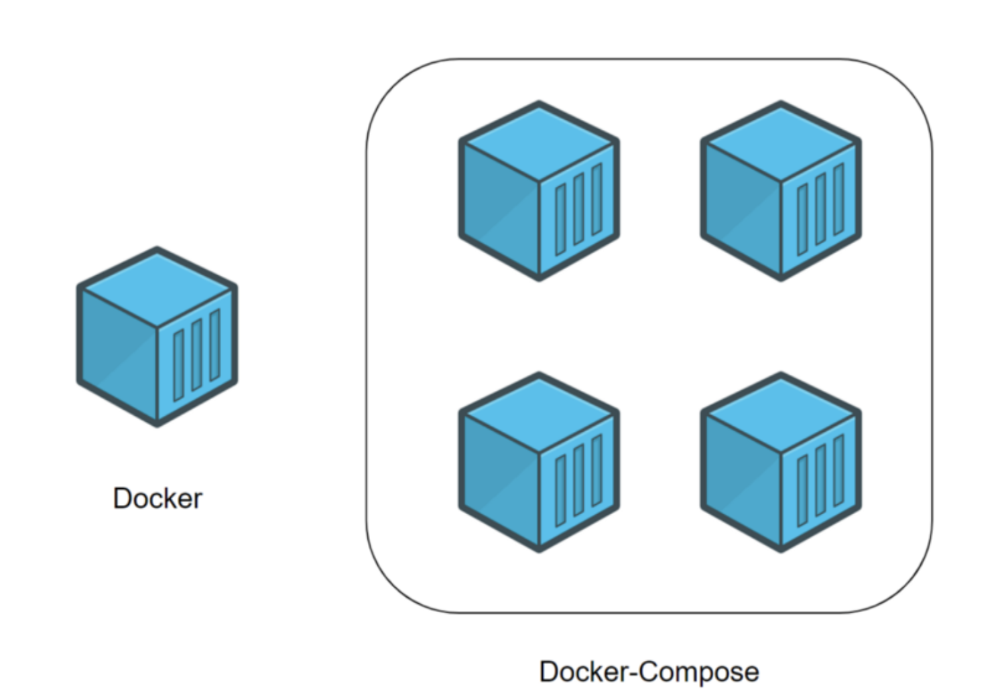

# Лабораторная работа по облачным технологиям №2*

Разница между Docker и Docker Compose
Для начата выясним в чем разница между Docker и docker-compose файлами ....


Docker применяется для управления отдельными контейнерами, из которых состоит приложение.
Docker Compose используется для одновременного управления несколькими контейнерами, входящими в состав приложения. А так это такой же инстпумент управления




### Пример плохого docker-compose файла

```
version: '3.8'
services:
  flask-app:
    build: .
    ports:
      - "5001:5000"
    environment:
      - COMPOSE_FILE_NAME=bad-docker-compose.yml
      - SECRET_KEY=hardcoded_secret
    volumes:
      - /tmp:/tmp
    command: python app.py
```

### Допущенные ошибки :
1) Секретный ключь хранится прямо в файле конфигураций `SECRET_KEY=hardcoded_secret` - это уязвляет безопасность при попадании в систему контроля версий. Также невозможно использовать разные секретные ключи для разных окружений 
2) Не указан Dockerfile и не исключены ненужные файлы `build: .` из-за чего случается копирования всех файлов, и как итог получаем большой размер образа :(
3) Небезопасное монтирование системных директорий `volumes:    - /tmp:/tmp` получается мы сохраняем кучу ненужных файлов, часть из которых даже не принадлежат нашему серверу.И мы и не только храним, но и можем изменять тк ограничения не прописаны

Тем не менее все собирается и запускается :)


### Рассмотрим пример хорошего docker-compose файла и как были исправленны ранее допущенные ошибки

```
version: '3.8'
services:
  flask-app:
    build:
      context: .
      dockerfile: Dockerfile
    ports:
      - "5001:5000"
    environment:
      - COMPOSE_FILE_NAME=good-docker-compose.yml
      - SECRET_KEY_FILE=/run/secrets/secret_key
    secrets:
      - secret_key
    volumes:
      - ./data:/app/data:ro
    command: python app.py
    restart: unless-stopped
    user: "1000:1000"

secrets:
  secret_key:
    file: ./secret.txt
```
1) Теперь секретный ключ хранится в отдельном файле, к которому указан путь `SECRET_KEY_FILE=/run/secrets/secret_key`, что повышает безопасность 
2) Явное указание контекста сборки и Dockerfile
3) Явно указываем  что  и куда копируем `- ./data:/app/data:ro` ( что : `./data` , куда: в папочку по этому пути`/app/data`, ro - указывает что файлы открыты только на чтение)

Файл с хорошими практиками также собрался и запустился :)


Файл с хорошими практиками также собрался и запустился :)
