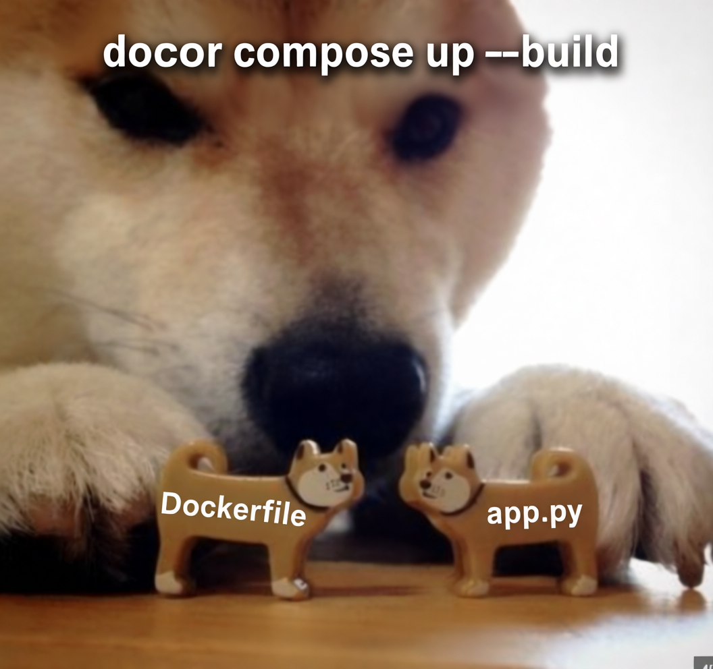
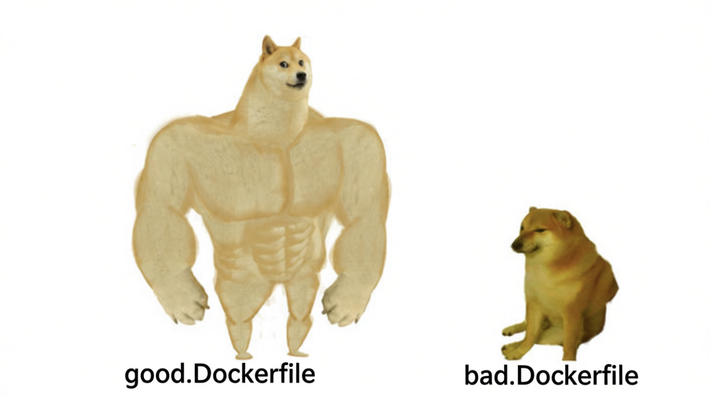

# Лабораторная работа №2

Для начала создадим все нужные нам файлы, потому что без приложения Dockerfile в целом не будет работать, так как является только файлом с инструкциями 



### Итак рассмотрим плохой пример Dockerfile:

```
FROM python

RUN pip install flask

COPY . .

ENV PORT=5003
ENV APP_NAME=Bad-App

CMD ["python", "app.py"]
```
1) У нас не указана точная верси python `FROM python`, что может привести к проблемам, потому что после выхода новой версии python часть старых функций, которые используются в коде может быть обновлена или удалена, что приведет к непредсказуемому результату или ошибке.  

2) Установление зависимостей также требует указание точных версий `RUN pip install flask`  

3) При `COPY . .`  происходит копирование в образ всего, что в данный момент лежит в этой папке, в том числе файлы с паролями и пр, что не очень то безопассно. Также при любых изменениях (даже README) все может сломаться...  

### В этот раз нам повезло и при работе ошибок не случилось )


### Выше описанные ошибки мы исправили в good.Dockerfile, рассмотрим его :

```
FROM python:3.9-slim

WORKDIR /app

COPY requirements.txt .

RUN pip install --no-cache-dir -r requirements.txt

COPY app.py .

ENV PORT=5003
ENV APP_NAME=Good-App

EXPOSE 5003

USER nobody

CMD ["python", "app.py"]
```
1) Версия python указани и ничто не сможет помешть сборке и запуску контейнера
2) Указываем конкретное место куда будем копировать файлы `WORKDIR /app`. Далее копируем файлы с указанием версии flask, `RUN pip install --no-cache-dir -r requirements.txt` устанавливаем зависимости.
3) Копирование происходит поэтопно и точечно 

### Здесь тоже все прошло без ошибок, но good.Dockerfile более надежная версия


  
### Все ошибки из bad.Docker были исправлены. Мы научились писать правильные Dockerfile ура


## Что же ещё нельзя делать при работе с контейнерами ?

#### - Запуск контейнеров в интерактивном режиме для production . Этот подход рушит основную идею контейнеризации, делая контейнер полностью зависимым от разработчика: При закрытии терминала контейнер умирает, не может работать в фоновом режиме, команда `docker logs` недоступна
#### - Хранение состояния в контейнере.  При пересоздании контейнера старые данные теряются, а также нарушается принцип идемпотентности и усложняется масштабирование
