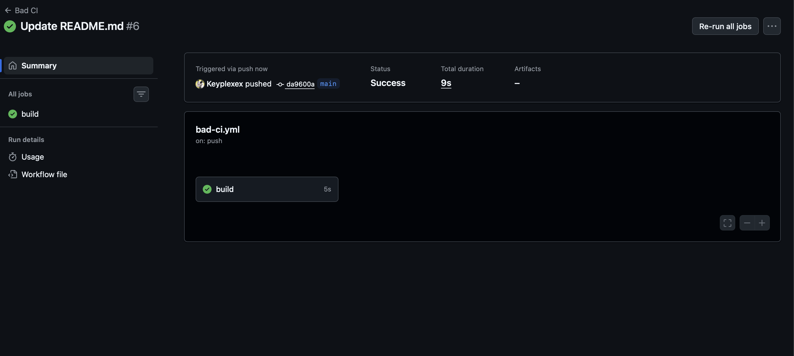

# Лабораторная работа №3  
## CI/CD: плохие и хорошие практики

Начали писать эту лабу с истории про Василия. В целом, познавательная статейка с небольшим юморком про ошибочки и хранение в облаке. Так вот, по моему лицу прокатилась слеза, так как очень сильно было похоже на RAID, я именно про часть с хранением в облаке, так как есть похожие вещи с разделением на носители, только они не облачные, а физические. В целом, там тоже есть разные архитектуры, при которых данные распределяются по-разному: от главного к другим, между всеми одно и то же, из-за чего могут возникать разные ошибки в протоколах и приколы с удалением и поставкой новых данных. Не знаю, как конкретно это реализовано в облаке - есть ли там те же проблемы или как работает "под капотом", но было забавно словить ассоциацию на носители памяти.

Если говорить про CI/CD, в целом становится понятно, как оно используется в разработке)

---

## Сравнение bad / good practices

| № | Плохая практика | Почему это плохо | Как исправлено в `good-ci.yml` |
|---|-----------------|------------------|--------------------------------|
| 1 | Отсутствие кэширования зависимостей | При каждом запуске workflow зависимости загружаются заново. Это увеличивает время выполнения CI, создает лишнюю нагрузку на сеть и делает pipeline менее эффективным, особенно при частых коммитах (но как будто в любом оптимизированном коде необходмо использование кэширования). | Добавлено кэширование с помощью `actions/cache`, что позволяет повторно использовать ранее установленные зависимости и значительно ускоряет сборку. |
| 2 | Игнорирование ошибок команд (II true) | Ошибки во время выполнения тестов или сборки не приводят к падению workflow. В результате CI может завершиться успешно даже при наличии критических ошибок в проекте, что снижает доверие к автоматическому тестированию (для меня это самое ужасное, тк такое было у одного из знакомых - его препод это не учел, поэтому написать лабу на макс балл можно было если только у тебя она неправильная :) ). | Убрано игнорирование ошибок. Любая ошибка в тестах или сборке завершает workflow с ошибкой, что обеспечивает корректный контроль качества. |
| 3 | Запуск CI при каждом push во все ветки | Workflow запускается даже для временных или экспериментальных веток, что приводит к избыточному использованию ресурсов CI и увеличению времени ожидания для важных веток. | Настроен запуск CI только для веток `main` и `develop`, что соответствует типичному git-flow и снижает нагрузку на систему. |
| 4 | Отсутствие логического разделения этапов | Установка зависимостей, тестирование и сборка выполняются без четкого разделения ответственности, что усложняет чтение workflow и отладку ошибок. | Workflow структурирован на отдельные шаги (install → test → build), что улучшает читаемость и упрощает диагностику проблем. |

---

## Плохой пример CI: `bad-ci.yml`

```
name: Bad CI

on:
  push:

jobs:
  build:
    runs-on: ubuntu-latest
    steps:
      - uses: actions/checkout@v2

      - name: Fake install step
        run: echo "Installing dependencies"

      - name: Fake tests (ignore errors)
        run: echo "Running tests" || true

      - name: Fake build
        run: echo "Build completed"
```

## Недостатки
- отсутствие кэширования зависимостей
- ошибки тестов не чекаются
- CI запускается для всех и всегда (по сути в этом даже смысла особо нет)
- workflow сложно масштабировать и отлаживать (-вайб, масштабирование для разработки в целом ключевая вещь)

## Хороший пример CI: `good-ci.yml`

```
name: Good CI

on:
  push:
    branches:
      - main
      - develop

jobs:
  build:
    runs-on: ubuntu-22.04

    steps:
      - name: Checkout repository
        uses: actions/checkout@v4

      - name: Cache dependencies
        uses: actions/cache@v3
        with:
          path: .cache
          key: ${{ runner.os }}-cache-${{ github.run_id }}

      - name: Install dependencies
        run: |
          mkdir -p .cache
          echo "Dependencies installed" > .cache/deps.txt

      - name: Run tests
        run: echo "Running tests"

      - name: Build project
        run: echo "Build completed"
```

## Преимущества
- быстрее работает CI за счет кэширования
- правильная обработка ошибок
- оптимизированный запуск workflow
- хорошая читаемость и готовность к масштабированию


